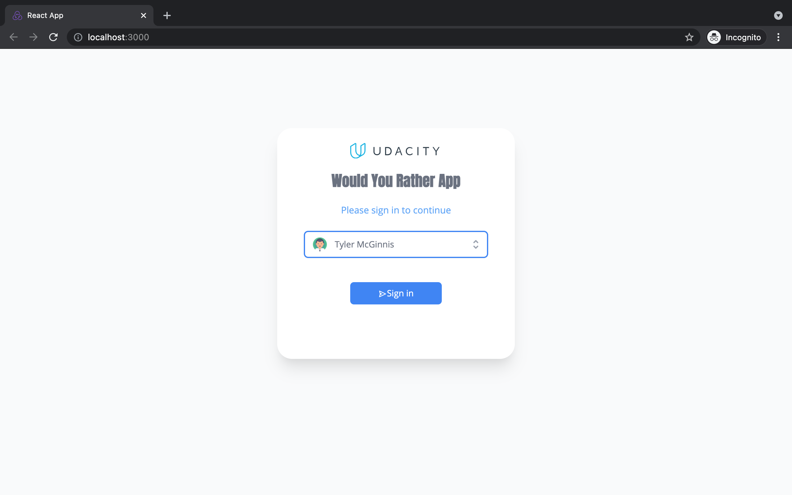
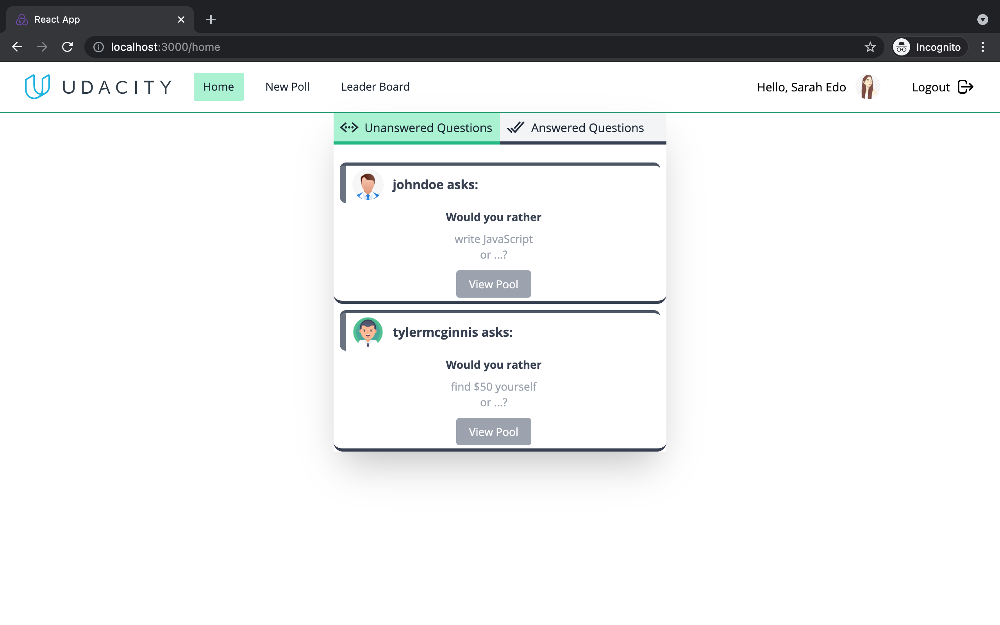
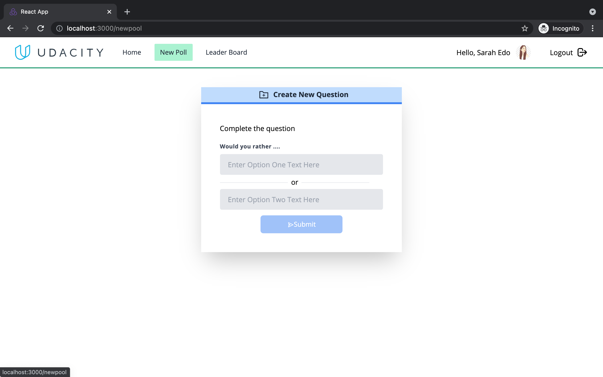
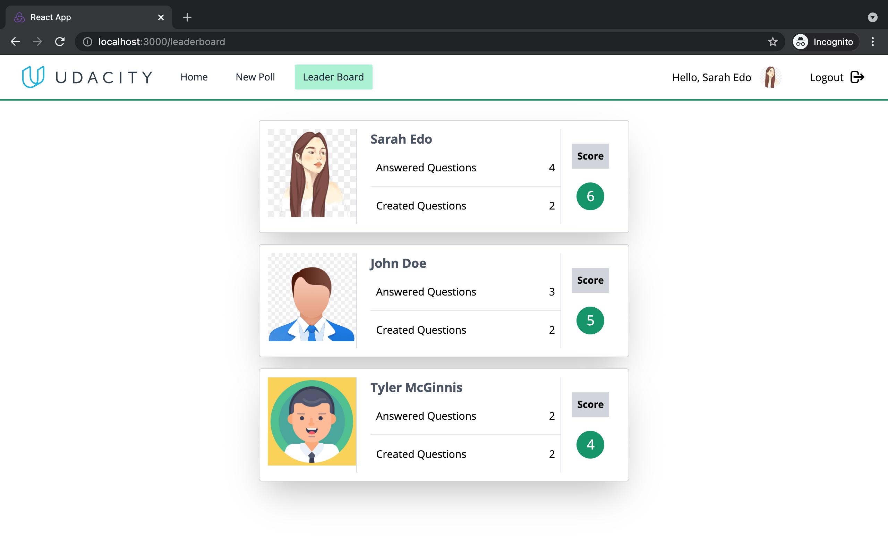

# Would You Rather

Would You Rather is a questions / answers game. 

# Introduction
This app lets a user play the “Would You Rather?” game. The game goes like this: A user is asked a question in the form: “Would you rather [option A] or [option B] ?”. Answering "neither" or "both" is against the rules. And there is a poll system which indicates the votes for ther user.

# Installation Instructions

Clone the repository, change directories, and use NPM to install the dependencies.

```bash
$ git clone https://github.com/rogerndutiye/would-you-rather.git
$ cd would-you-rather
$ npm install
```

## Usage

* start development server with `npm start` or `sudo npm start`

- `npm start`

now The project can be viewed in the browser at

- [http://localhost:3000](http://localhost:3000)

The page will reload if you make edits.\
You will also see any lint errors in the console.

## Screenshots









